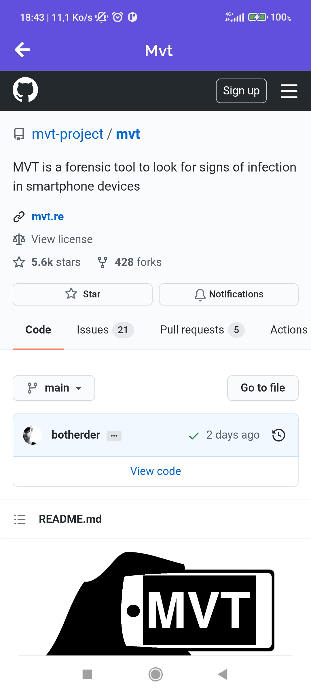

# Gemography Coding Challenge

This project is a coding challenge that aims to implement a small app using React Native that will list the most starred Github repos that were created in the last 30 days by fetching the sorted JSON data directly from the Github API (Github API explained down below).

## Important Note ! ⚠️

This App has been only tested on an android device

## Prerequisites

- [Node.js > 12](https://nodejs.org) and npm (Recommended: Use [nvm](https://github.com/nvm-sh/nvm))

- [JDK > 11](https://www.oracle.com/java/technologies/javase-jdk11-downloads.html)
- [Android Studio and Android SDK](https://developer.android.com/studio)

## Base dependencies

- [axios](https://github.com/axios/axios) for networking.
- [react-native-paper](https://callstack.github.io/react-native-paper) for some ready to use components .
- [react-query](https://react-query.tanstack.com/) to cache response data from api.
- [react-navigation](https://reactnavigation.org/) navigation library.
- [react-native-webview](https://github.com/react-native-webview/react-native-webview) WebView to view Repos InApp.

## Folder structure

This template follows a very simple project structure:

- `src`: This folder is the main container of all the code inside your application.
  - `assets`: Asset folder to store all images, vectors, etc.
  - `components`: Folder to store any common component that you use through your app (such as a generic button)
  - `constants`: Folder to store any kind of constant that you have.
  - `screens`: Folder that contains all the application screens/features.
    - `Screen`: Each screen should be stored inside its folder and inside it a file for its code and a separate one for the styles and tests.
      - `Screen.js`
      - `Screen.styles.js`
      - `Screen.test.js`
  - `theme`: Folder to store all the styling concerns related to the application theme.
  - `App.js`: Main component that starts the whole app.
  - `index.js`: Entry point of your application as per React-Native standards.
  - `api`: Folder that manages api calls
  - `services`: Folder that contains constants and helperFunctions
  
## Setup environments

[https://reactnative.dev/docs/environment-setup](https://reactnative.dev/docs/environment-setup) follow these steps to setup the environment to run on a real or virtual device

## Running the app

After setting up the environment, you will need to follow these steps:

1. Download or clone this project 
```Shell
git clone https://github.com/badred1/GemographyCG.git
```
2. Navigate to the folder and download and install the dependencies
```Shell
npm install
```
3. Start the app
```Shell
npx react-native run-android
```
If you installed an AVD device in Android Studio it should run automatically, if you want to run on a real device make sure you enable USB debugging on your device and it is listed in `adb devices` command

## Download the apk

In order to reduce the apk fileSize, I had to generate two separate .apk files because Android devices support two major device artitectures armebi and x86, and  by default RN builds the native librariers for both these artitectures into the same apk.
So choose one of the following files: 

- armebi : [https://drive.google.com/file/d/1lxXJw8N4TsYbugn_rJzgYtwbP2Qx6vKi/view?usp=sharing](https://drive.google.com/file/d/1lxXJw8N4TsYbugn_rJzgYtwbP2Qx6vKi/view?usp=sharing)
- x86 : [https://drive.google.com/file/d/1N5ngwEI_3c2S0fxl35A1rFqce1wgRQ2L/view?usp=sharing](https://drive.google.com/file/d/1N5ngwEI_3c2S0fxl35A1rFqce1wgRQ2L/view?usp=sharing)

## Screenshots

<div align="center">
  
  
  
  
  
</div>


